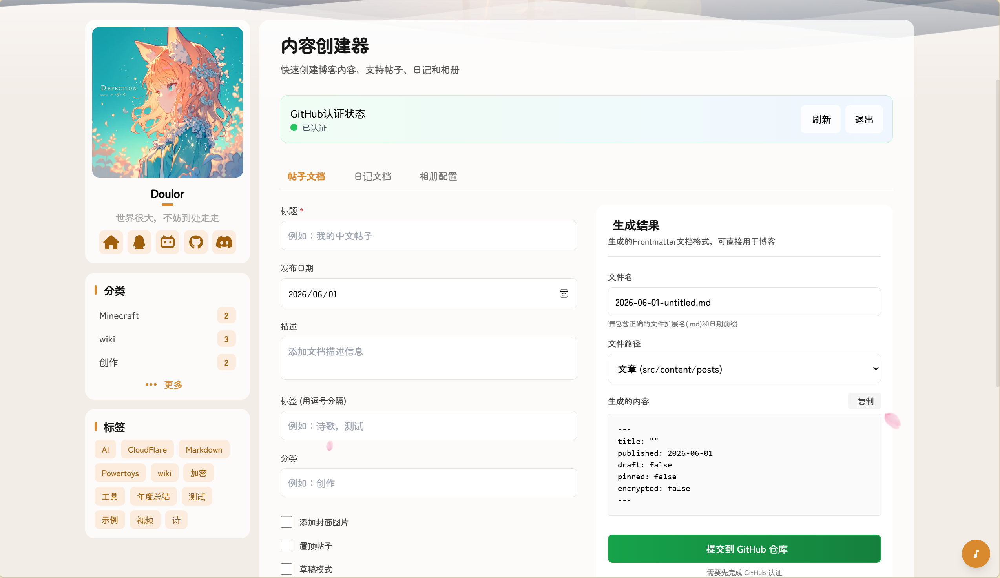
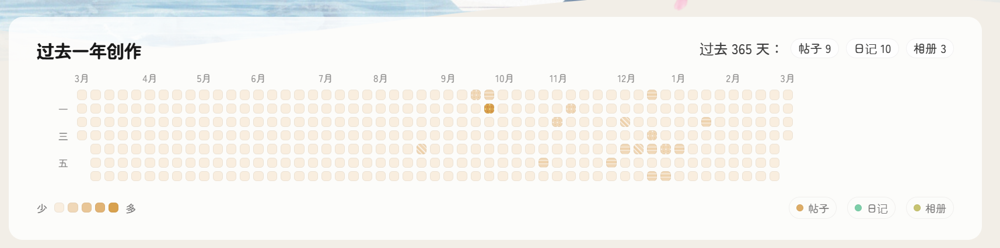

# 🌸 Mizuki — 个人博客 (Fork)


[](https://opensource.org/licenses/MIT)






一个现代化、功能丰富的静态博客模板，基于 [Astro](https://astro.build) 构建。

本项目是 **[LyraVoid/Mizuki](https://github.com/LyraVoid/Mizuki)** 的 Fork 分支，进行了规模性重构。核心特色是**网页端内容推送系统**——你可以直接在网页界面创建、编辑、删除博客帖子、日记和相册，并将变更推送到 GitHub 仓库，无需在本地操作代码。

[**🖥️ 在线演示**](https://doulor.cn/) &nbsp;|&nbsp; [**📝 博客地址**](https://blog.doulor.cn/)

🌏 README 语言
[**English**](./README.md) /
[**中文**](./README.zh.md) /
[**日本語**](./docs/README.ja.md) /
[**中文繁体**](./docs/README.tw.md) /

---

## ⚠️ 关于此 Fork

本分支基于 [LyraVoid/Mizuki](https://github.com/LyraVoid/Mizuki)（上游最新版已至 v9.0+），进行了规模性重构。由于上游仍在持续更新，本分支的部分功能可能落后于上游最新版本。

### 与上游的主要差异

| 方面 | 本分支 (Doulor/Blog) | 上游 (LyraVoid/Mizuki) |
|---|---|---|
| **核心特色** | 网页端内容推送系统（在线创建/编辑/删除） | 代码-内容分离模式，自动分辨率适配 |
| **Astro 版本** | 5.x | 6.x |
| **Tailwind CSS** | v3 | v4 |
| **内容管理** | 网页端直接创建内容并提交到 GitHub | 本地编辑器操作 |
| **图片灯箱** | PhotoSwipe | Fancybox |
| **密码保护** | bcryptjs/crypto-js 加密 | 不支持 |
| **留言板** | Supabase 后端 | Twikoo |
| **许可证** | MIT | Apache 2.0 |

---

## 🔥 核心特色：网页端内容推送

这是本分支最重要的功能。通过网页界面，你可以：

- **📝 内容创建器** (`/create-content/`) — 在线创建帖子、日记、相册，生成 frontmatter 后直接推送到 GitHub 仓库
- **📋 内容管理器** (`/content-manager/`) — 浏览、搜索、编辑、删除博客中已有的所有内容
- **✏️ 在线编辑器** (`/my-editor/`) — 统一的内容编辑界面

所有这些操作通过 **GitHub Personal Access Token** 认证，内容会以 commit 的形式直接提交到你的 GitHub 仓库，触发 Vercel/Netlify 等平台的自动部署。

---

## ✨ 功能特性

### 🔥 网页端内容管理（核心功能）
- [x] **内容创建器** — 通过可视化表单创建帖子、日记和相册
- [x] **内容管理器** — 在线浏览、搜索、编辑和删除所有内容
- [x] **在线编辑器** — 在浏览器中获得完整的 Markdown 编辑体验
- [x] **GitHub API 集成** — 通过 Personal Access Token 直接推送内容
- [x] **内容加密** — 支持帖子密码保护和日记隐藏内容
- [x] **R2 图片支持** — 从 Cloudflare R2 存储获取相册和日记图片

### 🎨 设计与界面
- [x] 基于 [Astro](https://astro.build) 和 [Tailwind CSS](https://tailwindcss.com) 构建
- [x] 使用 [Swup](https://swup.js.org/) 实现流畅的动画和页面过渡
- [x] 明暗主题切换，支持系统偏好检测
- [x] 可自定义主题色彩和动态横幅轮播
- [x] 全屏背景图片，支持轮播、透明度和模糊效果
- [x] 全设备响应式设计
- [x] 使用 JetBrains Mono 字体的优美排版
- [x] **Pio 看板娘**（Live2D）互动角色

### 🔍 内容与搜索
- [x] 基于 [Pagefind](https://pagefind.app/) 的高级搜索功能
- [x] 增强的 Markdown 功能，支持语法高亮
- [x] 交互式目录，支持自动滚动
- [x] RSS 订阅生成
- [x] 阅读时间估算
- [x] 文章分类和标签系统

### 🌐 国际化支持
- [x] 多语言支持，实时翻译功能
- [x] 自动语言检测，基于用户偏好
- [x] 客户端翻译，由 Edge Translate 驱动
- [x] 支持 10+ 种语言（中文、英文、日文、韩文、西班牙文等）

### 📱 特色页面
- [x] **追番页面** — 追踪动画观看进度和评分
- [x] **友链页面** — 精美卡片展示朋友网站
- [x] **日记页面** — 分享生活瞬间，类似社交媒体
- [x] **归档页面** — 有序的文章时间线视图
- [x] **关于页面** — 可自定义的个人介绍
- [x] **留言板** — 基于 Supabase 的访客留言系统

### 🛠 技术特性
- [x] 增强代码块，基于 [Expressive Code](https://expressive-code.com/)
- [x] 数学公式支持，KaTeX 渲染
- [x] 图片优化，PhotoSwipe 画廊集成
- [x] SEO 优化，包含站点地图和元标签
- [x] 性能优化，懒加载和缓存机制
- [x] Supabase 集成用于留言板

## 🚀 快速开始

### 📦 安装

1. **克隆仓库：**
   ```bash
   git clone https://github.com/Doulor/Blog.git
   cd Blog
   ```

2. **安装依赖：**
   ```bash
   # 如果没有安装 pnpm，先安装
   npm install -g pnpm

   # 安装项目依赖
   pnpm install
   ```

3. **配置博客：**
   - 编辑 `src/config.ts` 自定义博客设置
   - 更新站点信息、主题色彩、横幅图片和社交链接
   - 配置翻译设置和特色页面功能
   - 在 `.env` 中配置 Supabase 凭证（留言板功能，可选）
   - 设置 `PUBLIC_SUPABASE_URL` 和 `PUBLIC_SUPABASE_ANON_KEY`

4. **启动开发服务器：**
   ```bash
   pnpm dev
   ```
   博客将在 `http://localhost:4321` 可用

### 📝 网页端内容管理

网页端内容管理系统是本分支的核心功能：

- **创建内容：** 访问 `/create-content/` 创建帖子、日记或相册
- **管理内容：** 访问 `/content-manager/` 浏览、编辑或删除已有内容
- **编辑内容：** 访问 `/my-editor/` 使用统一编辑界面

所有操作需要 **GitHub Personal Access Token**（存储在浏览器的 localStorage 中）。内容会直接以 commit 的形式推送到 GitHub 仓库。

### 🚀 部署

将博客部署到任何静态托管平台：

- **Vercel：** 连接 GitHub 仓库到 Vercel
- **Netlify：** 直接从 GitHub 部署
- **GitHub Pages：** 使用包含的 GitHub Actions 工作流
- **Cloudflare Pages：** 连接你的仓库

部署前，请在 `astro.config.mjs` 中更新 `site` URL。

## 📝 文章前言格式

```yaml
---
title: 我的第一篇博客文章
published: 2023-09-09
description: 这是我新博客的第一篇文章。
image: ./cover.jpg
tags: [标签1, 标签2]
category: 前端
draft: false
pinned: false
lang: zh-CN      # 仅当文章语言与 config.ts 中的站点语言不同时设置
---
```

### Frontmatter 字段说明

- **title**: 文章标题（必需）
- **published**: 发布日期（必需）
- **description**: 文章描述，用于 SEO 和预览
- **image**: 封面图片路径（相对于文章文件）
- **tags**: 标签数组，用于分类
- **category**: 文章分类
- **draft**: 设置为 `true` 在生产环境中隐藏文章
- **pinned**: 设置为 `true` 将文章置顶
- **lang**: 文章语言（仅当与站点默认语言不同时设置）

## 🧩 Markdown 扩展语法

Mizuki 支持超越标准 GitHub Flavored Markdown 的增强功能：

### 📝 增强写作
- **提示框：** 使用 `> [!NOTE]`、`> [!TIP]`、`> [!WARNING]` 等创建精美的标注框
- **数学公式：** 使用 `$行内$` 和 `$$块级$$` 语法编写 LaTeX 数学公式
- **代码高亮：** 高级语法高亮，支持行号和复制按钮
- **GitHub 卡片：** 使用 `::github{repo="用户/仓库"}` 嵌入仓库卡片

### 🎨 视觉元素
- **图片画廊：** 自动 PhotoSwipe 集成，支持图片查看
- **可折叠部分：** 创建可展开的内容块
- **自定义组件：** 使用特殊指令增强内容

### 📊 内容组织
- **目录：** 从标题自动生成，支持平滑滚动
- **阅读时间：** 自动计算和显示
- **文章元数据：** 丰富的前言支持，包含分类和标签

## ⚡ 命令

所有命令都在项目根目录运行：

| 命令                       | 操作                                    |
|:---------------------------|:---------------------------------------|
| `pnpm install`             | 安装依赖                               |
| `pnpm dev`                 | 在 `localhost:4321` 启动本地开发服务器 |
| `pnpm build`               | 构建生产站点到 `./dist/`               |
| `pnpm preview`             | 在部署前本地预览构建                   |
| `pnpm check`               | 运行 Astro 错误检查                    |
| `pnpm format`              | 使用 Biome 格式化代码                  |
| `pnpm lint`                | 检查并修复代码问题                     |
| `pnpm new-post <文件名>`   | 创建新博客文章                         |
| `pnpm astro ...`           | 运行 Astro CLI 命令                    |

## 🎯 配置指南

### 🔧 基础配置

编辑 `src/config.ts` 自定义你的博客：

```typescript
export const siteConfig: SiteConfig = {
  title: "你的博客名称",
  subtitle: "你的博客描述",
  lang: "zh-CN", // 或 "en"、"ja" 等
  themeColor: {
    hue: 210, // 0-360，主题色调
    fixed: false, // 隐藏主题色选择器
  },
  translate: {
    enable: true, // 启用翻译功能
    service: "client.edge", // 翻译服务
    defaultLanguage: "chinese_simplified",
  },
  banner: {
    enable: true,
    src: ["assets/banner/1.webp"], // 横幅图片
    carousel: {
      enable: true,
      interval: 0.8, // 秒
    },
  },
};
```

## 📄 许可证

本项目是 [LyraVoid/Mizuki](https://github.com/LyraVoid/Mizuki) 的 Fork 分支，进行了规模性重构，基于 MIT 许可证。

原始 Mizuki 项目基于 [Fuwari](https://github.com/saicaca/fuwari) 模板，由 [saicaca](https://github.com/saicaca) 创建。

## 🙏 致谢

本博客建立在以下优秀项目的基础上：

- **上游项目**：[LyraVoid/Mizuki](https://github.com/LyraVoid/Mizuki)，由 [LyraVoid](https://github.com/LyraVoid) 维护——本分支的原型
- **原始模板**：[Fuwari](https://github.com/saicaca/fuwari)，由 [saicaca](https://github.com/saicaca) 创建
- **设计灵感**：[Yukina](https://github.com/WhitePaper233/yukina) — 一个美丽优雅的博客模板
- **框架**：基于 [Astro](https://astro.build) 和 [Tailwind CSS](https://tailwindcss.com)
- **翻译功能**：由 [translate](https://gitee.com/mail_osc/translate) 提供支持
- **图标**：来自 [Iconify](https://iconify.design/)

### 关于此 Fork

本分支专注于为 Mizuki 模板添加**网页端内容管理能力**：
- 网页端内容创建、编辑和删除
- GitHub API 集成实现内容推送
- 帖子密码保护和日记隐藏内容
- 基于 Supabase 的留言板后端
- Cloudflare R2 集成用于图片管理

---

⭐ 如果你觉得这个项目有帮助，请考虑给它一个星标！
